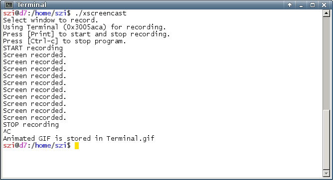

# xscreencast

Record screen based on keyboard events into an animated GIF.  I wrote
the script for a question at [Stackexchange][1].  The question
contains two examples.

[1]: https://emacs.stackexchange.com/questions/18607/how-to-set-the-foreground-color-of-the-cursor-face

This is a screen shot after a recording session.

It is not possible to record two screens at the same time.  That is
the reason, why I can not show a screen cast from `xscreencast`.

The script requires the following tools: `xwininfo`, `xinput`, `xwd`,
`convert`.  The first three are standard tools of the X server.

    $ dpkg -S $(type -p xinput xwininfo xwd)
    xinput: /usr/bin/xinput
    x11-utils: /usr/bin/xwininfo
    x11-apps: /usr/bin/xwd

The last is the graphics conversion tool ImageMagick.

    $ dpkg -S $(readlink -f $(type -p convert))
    imagemagick-6.q16: /usr/lib/i386-linux-gnu/ImageMagick-6.8.9/bin-Q16/convert
